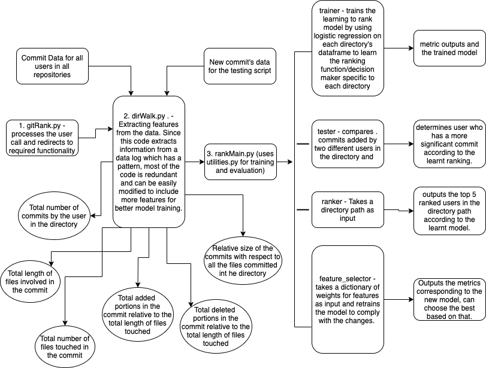

## GitRanker: Rank users in a directory based on their commit activity.

The aim of this project was to build a robust system for repository based ranking of users on github taking into account their commit activity corresponding to the said repository. The output of the ranker is a table of the top 5 users with their email and rank score assigned to theem via the model. The training and testing data for the LR model are taken as a random split from the commits currently logged and the weights of the model can be altered to train it again via the feature_selector functionality.

If the trained model is deleted from the repository, one has to necessariily run the trainer/feature_selector script first before moving forward to ranker or tester. The parent file to. run all the operations given below is gitRank.py. 

Files Changed/Added to the original repository:

1. gitRanker.py
2. new_commit (only in case of tester)
3. weights_dict.json (only in case of feature_selector)
4. dirWalk.py
5. final_dir_data
6. new_commit_data (only in case of tester)
7. rankMain.py
8. utilities.py (used within rankMain)
9. trained_model_dic_pkl (stores the currently trained model)
10. test.txt (contains the commit logs backup)

There are four possible operations one can perform. They are explained in detail below:

1. **ranker** - this just directly outputs the rank for the user's choice of a folder based on currently trained data.
Run the program as: `python3 gitRanker.py ranker (arg1) <folder_path> (arg2)`

2. **tester** - it takes an input file containing a commit sample from 2 users and helps determine the final directory based relevance scores assigned to them.
Needs atleast two commits from different users in the same directory to compare their influence and ranking.
Run the program as: `python3 gitRanker.py tester (arg1) <input_file> (arg2) <directory_path> (arg3)`

3. **trainer** - it simply retrains the whole program again, periodic has to  be done to keeep the system updated
Run the program as: `python3 gitRanker.py trainer (arg1)` 

4. **feature_selector** - this takes in a weight argument to decide a new weighting for the features including 0 as an option. Trains the network again with the new weights.
Run the program as: `python3 gitRanker.py ranker (arg1) <weight_dict_JsonFile> (arg2)`

sample - [weight_dict.json](https://github.com/ayush14029/go/blob/master/weight_dict.json)

`{
	"files_length":1e-7,
	"file_count":0.0055,
	"relative_added":0.0017,
	"relative_deleted":0.0007,
	"commit_count":0.00125,
	"relative_directory_contr":1
}`

Specify weights for all features, including 0 if feature is not needed. The ranking score of all users is calculated by taking into account the timestamp of commits (decaying function used to weigh the newer commits higher as compared to the older ones.)

**Note: For some directories (About 200/900), there might be too few training/testing samples to determine a legitimate ranking of the users and the commits in the particular directory. Additionally, these also include some directories which no longer exist due to. further. commits. In such a cases the rankings are not provided**

The following diagram explores the construction of the ranking function, the training of the Learning to Rank Model and the testing
performed against the metrics:

Direction For Expansion:

1. We could consider many additional features like:

	a. Giving preference to the reviewer of a comment in the directory.

	b. Deriving the semantic usefulness of each commit in the directory with respect to the readme within the directory.

	c. Considering the relative difference between comment and code in the commits.
2. Handling the cold start problem by providing every directory with a possible answer using a naive function.
3. Introducing non linearities in the ranking function instead of taking a linear combination of weights.
4. Training the Learning to Rank setup using a neural network as compared to a simple logistic regression as used.
5. Use pair of events in order to learn the ranking function. It will give us a better idea of relative importance of users which committed at close intervals to each other.
6. Making the feature extraction code more modular to easily include more features into the parent dictionary processed later.
